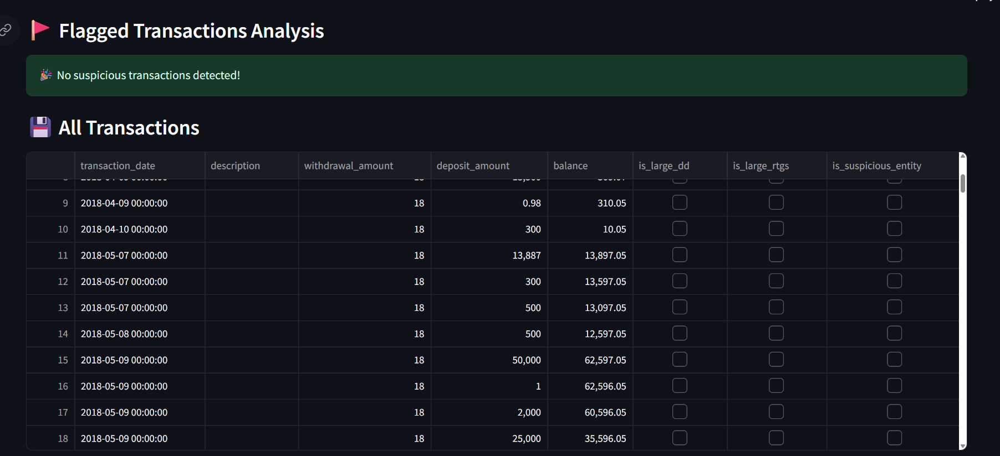

# Bank Statement Analyzer 🏦

A powerful Python tool to automatically extract, analyze, and visualize bank statement data from PDF files. Perfect for financial analysis and transaction monitoring.

**Live Demo:** [Coming Soon]  
**Repository:** [Bank-Statement-Analysis-Tool](https://github.com/surabhi-chandrakant/Bank-Statement-Analysis-Tool-)

---

## ✨ Features

- 📊 Extract transactions from **HDFC & ICICI PDF statements**
- 🔍 Analyze for suspicious transactions and patterns
- 📈 Interactive visualizations and charts
- 💾 Export data to CSV for further analysis
- 🚩 Flag large withdrawals, RTGS deposits, and specific entities
- 🎯 Clean Streamlit web interface

---

## ⚡ Quick Setup

### 1. Clone Repository
```bash
git clone https://github.com/surabhi-chandrakant/Bank-Statement-Analysis-Tool-.git
cd Bank-Statement-Analysis-Tool-
```

### 2. Create Virtual Environment
```bash
# Windows
python -m venv bank_env
bank_env\Scripts\activate

# Mac/Linux
python3 -m venv bank_env
source bank_env/bin/activate
```

### 3. Install Dependencies
```bash
pip install -r requirements.txt
```

### 4. Launch Application
```bash
streamlit run main.py
```

### 5. Open Browser
Visit 👉 [http://localhost:8501](http://localhost:8501) and upload your bank statement PDF.

---

## 🏦 Supported Banks

- ✅ **HDFC Bank** – Full transaction extraction and analysis  
- ✅ **ICICI Bank** – Complete statement processing  
- 🔄 *More banks coming soon!*  

---

## 📌 Usage Example

1. Upload your bank statement PDF  
2. View extracted account information  
3. Analyze transaction patterns  
4. Check flagged suspicious activities  
5. Download results as CSV  

---

## 📂 Project Structure

```
├── main.py                 # Main Streamlit application
├── pdf_extractor.py        # PDF parsing engine
├── analyzer.py             # Transaction analysis logic
├── visualizer.py           # Charts and graphs
├── utils.py                # Helper functions
└── requirements.txt        # Python dependencies
```

---

## 🖼️ Screenshots

### 📥 Uploading a Bank Statement


### 📊 Extracted Transactions


### 📈 Visualizations & Analysis


> 💡 Place your screenshots in a folder called `static/screenshots/` inside the project.

---

## ⚙️ Requirements

- Python **3.8+**
- Text-based PDF statements (not scanned images)
- HDFC/ICICI bank statements

---

## 🛠️ Troubleshooting

- Enable **Debug Mode** in the sidebar if you encounter issues.  
- This shows detailed processing information.

---

## 🔒 Privacy & Security

- All processing happens **locally** on your computer  
- **No data** is sent to external servers  
- Uploaded files are processed temporarily and deleted  

---

## 🤝 Contributing

Feel free to submit **issues** and **enhancement requests**!  
Built with ❤️ using **Streamlit, pandas, and pdfplumber**.
